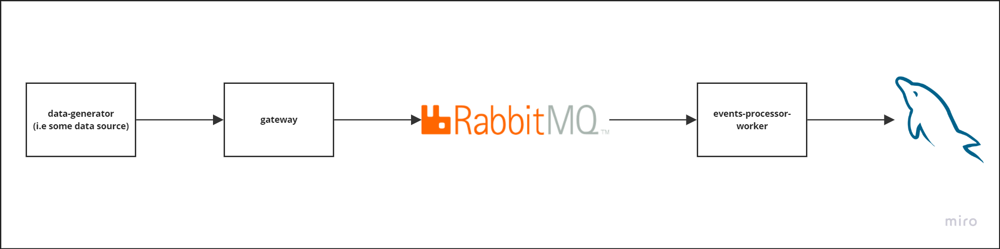

# Mega Logs

- Goal of the project is to be able to store large amount of incoming data to the database in a way that is both efficient and also doesn't overwhelm the database server.
- I've built this to explore Messaging Queue Systems and Concurrency in Go. I'm sure this can be improved quite a bit and I'm learning and exploring.

# Architecture



- **data-generator**
  - This component represents a data source. It could be logs that needs to be persisted, an running app that needs to store users data.\
    I've just used a [dataset from kaggle](https://www.kaggle.com/datasets/olistbr/brazilian-ecommerce?resource=download&select=olist_products_dataset.csv) for ecommerce where I read from it and send data to the gateway.
- **gateway**
  - This is the publisher in the messaging queue system. It recives data from the data-generator and queues it in RabbitMQ.
  - It should also have the cabability to rate limit the data to be sent to the queue. (not implemented)
- **events-processor-worker**
  - This is the consumer in the messaging queue system. It also controls the rate at which data is sent to the database to be persisted.

# Usage

- In the terminal run

```bash
docker compose up
```

- Hit endpoint `POST http://localhost:3001/generate-data/send-data-to-gateway` with empty payload.
